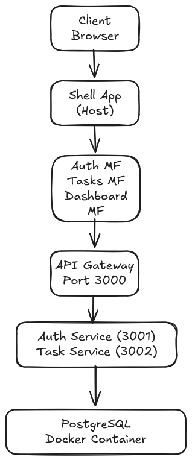
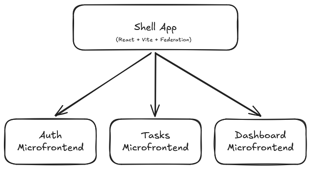
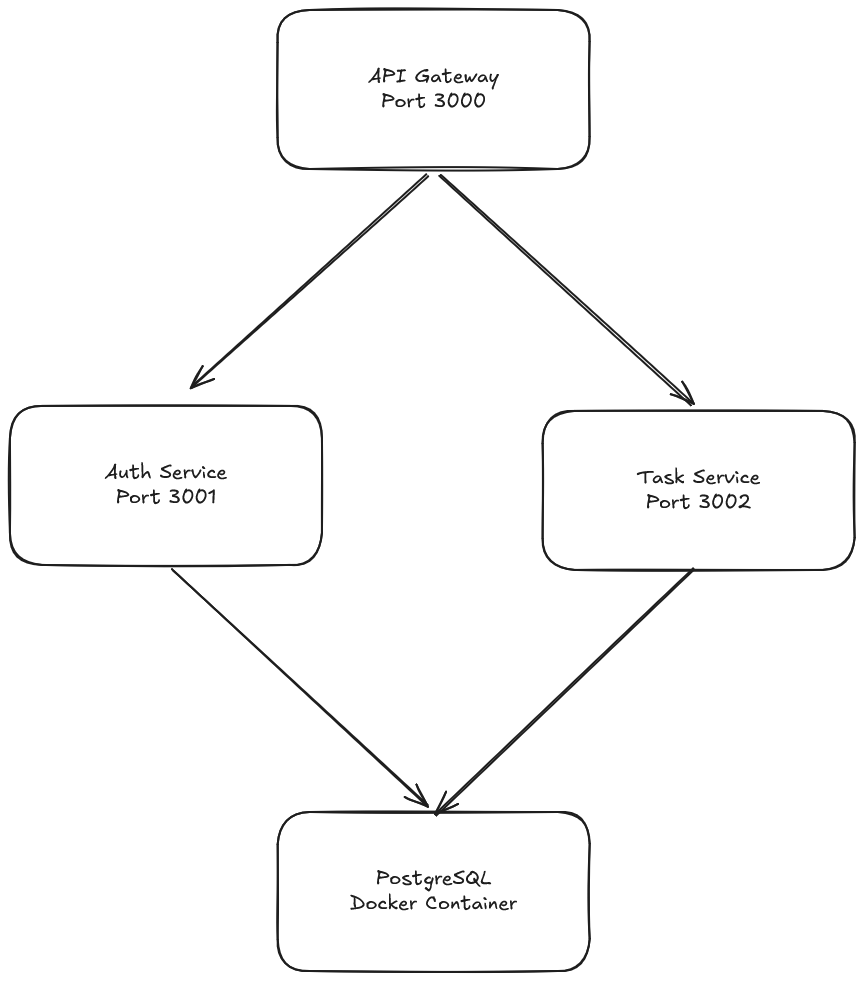
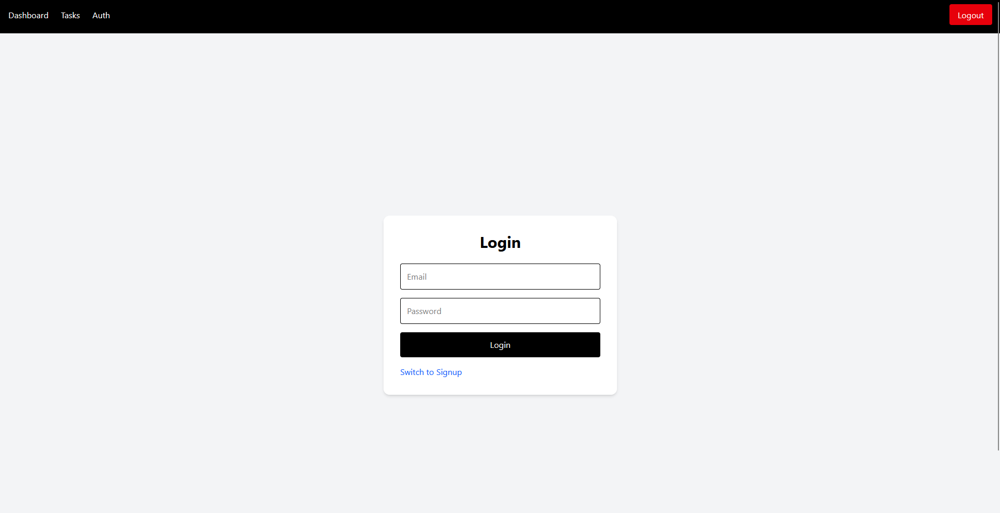
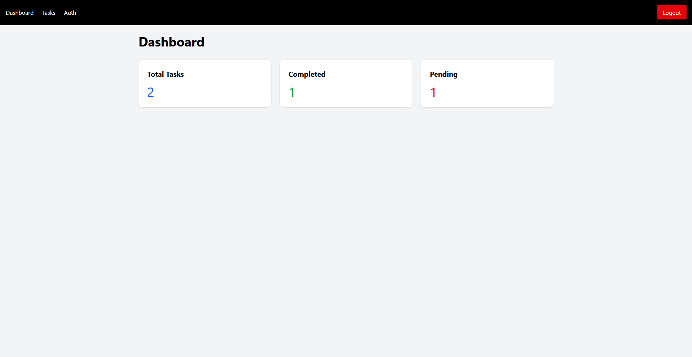
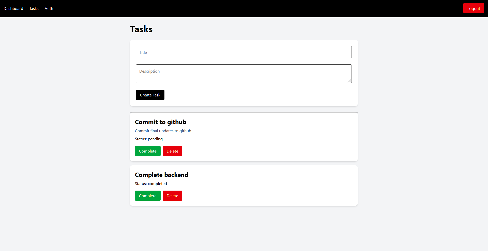
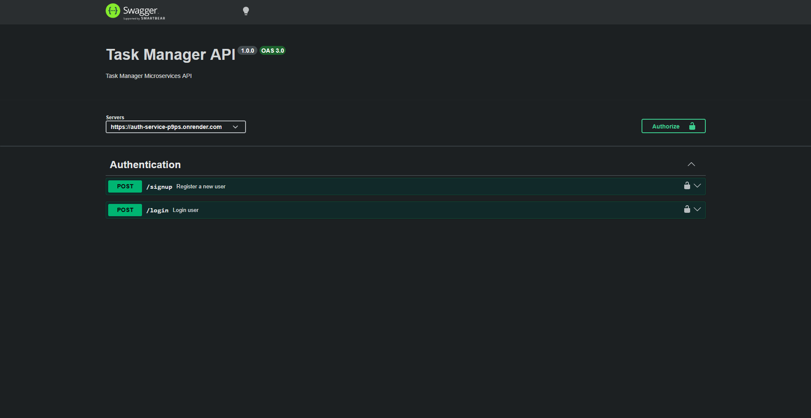
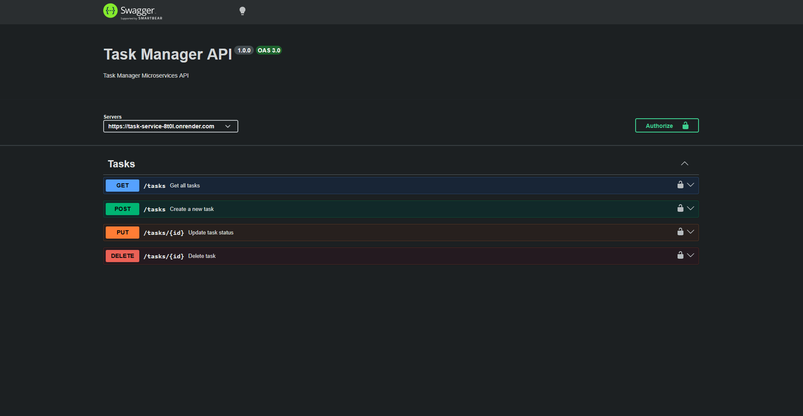

# Task Manager

A distributed full-stack enterprise task management application built using microfrontend and microservices architecture.

This project demonstrates:

- React microfrontends
- Module Federation
- API Gateway architecture
- JWT authentication
- PostgreSQL integration
- Dockerized infrastructure
- Enterprise-grade frontend/backend separation

## Architecture

### System Architecture



### Frontend Architecture



### Backend Architecture



## Tech Stack

| Layer | Technology |
|---|---|
| Frontend | React, Vite, TailwindCSS |
| Microfrontends | Module Federation |
| Backend | Node.js, Express |
| Database | PostgreSQL |
| Authentication | JWT |
| Containerization | Docker |
| API Docs | Swagger/OpenAPI |

## Microfrontends

The frontend uses a microfrontend architecture with Module Federation.

### Applications

- Shell App
- Auth Microfrontend
- Tasks Microfrontend
- Dashboard Microfrontend

## Microservices

### Backend Services

- API Gateway
- Auth Service
- Task Service

## OpenAPI Documentation

### Swagger Endpoints

- Auth Service: https://auth-service-p9ps.onrender.com/api-docs/
- Task Service: https://task-service-8t0l.onrender.com/api-docs/

# Setup Instructions

## 1. Clone Repository

```bash
git clone <your-repository-url>
```

---

## 2. Install Frontend Dependencies

```bash
cd apps/shell
npm install

cd ../auth-mf
npm install

cd ../tasks-mf
npm install

cd ../dashboard-mf
npm install
```

---

## 3. Install Backend Dependencies

```bash
cd services/api-gateway
npm install

cd ../auth-service
npm install

cd ../task-service
npm install
```

---

## 4. Start PostgreSQL

```bash
docker compose up -d
```

---

## 5. Run Backend Services

### API Gateway

```bash
cd services/api-gateway
npm start
```

### Auth Service

```bash
cd services/auth-service
npm start
```

### Task Service

```bash
cd services/task-service
npm start
```

---

## 6. Run Frontend Apps

### Shell

```bash
cd apps/shell
npm run dev
```

### Auth MF

```bash
cd apps/auth-mf
npm run dev
```

### Tasks MF

```bash
cd apps/tasks-mf
npm run dev
```

### Dashboard MF

```bash
cd apps/dashboard-mf
npm run dev
```

---

# Screenshots

### Login Page



### Dashboard



### Tasks Page



### Swagger Auth



### Swagger Tasks



---

# Features

- Distributed microfrontend architecture
- Microservices backend
- API Gateway routing
- JWT authentication
- Protected routes
- PostgreSQL persistence
- Dockerized database
- Swagger/OpenAPI documentation
- TailwindCSS modern UI
- Toast notifications
- Loading states

---

# Future Improvements

- Role-based access control
- Redis caching
- Kubernetes deployment
- CI/CD pipelines
- Unit/integration testing
- Real-time updates
- Production deployment

---
# Demo

https://task-manager-three-plum-11.vercel.app/


# Author

Richin Biju